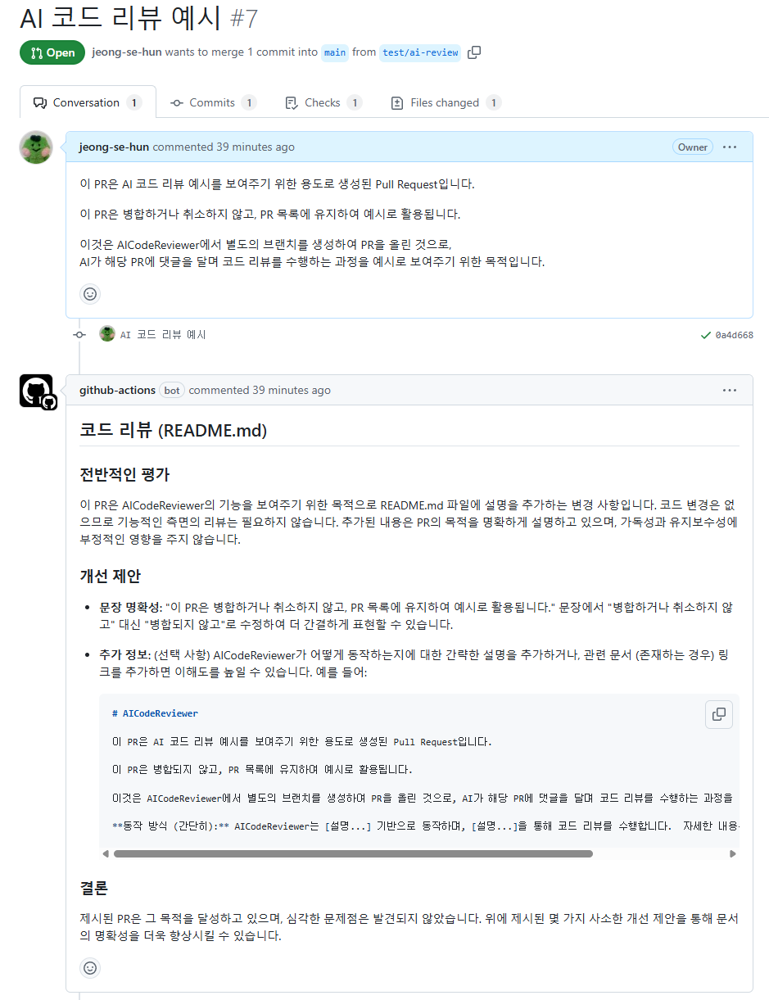

# AICodeReviewer

AICodeReviewer는 AI를 활용한 코드 리뷰 자동화 도구입니다.  
개발자들이 코드를 더 효율적으로 검토하고 품질을 높일 수 있도록,
GitHub Actions를 통해 코드 리뷰 프로세스를 자동화합니다.

## 주요 기능

- AI 기반 PR 분석 및 개선 제안
- GitHub Pull Request에 자동 리뷰 댓글 생성

## 사용 방법

AICodeReviewer는 GitHub Actions를 활용하여 동작합니다. 아래 단계를 따라 워크플로우를 설정해 주세요

### 1. 워크플로우 파일 추가

프로젝트 루트 디렉토리에 `/.github/workflows/ai-code-reviewer.yml` 파일을 추가합니다.

```yaml
name: AI Code Reviewer

on:
  pull_request:
    branches:
      - main
    types:
      - opened
      - synchronize

permissions:
  pull-requests: write

jobs:
  review:
    runs-on: ubuntu-latest
    steps:
      - name: Checkout Current Repository
        uses: actions/checkout@v3

      - name: Set up Node.js
        uses: actions/setup-node@v3
        with:
          node-version: "18"

      - name: Checkout AI Code Review
        uses: actions/checkout@v3
        with:
          repository: jeong-se-hun/AICodeReviewer

      - name: Install Dependencies
        run: npm install

      - name: Run AI Review Script
        env:
          GITHUB_TOKEN: ${{ secrets.GITHUB_TOKEN }}
          GITHUB_PR_NUMBER: ${{ github.event.pull_request.number }}
          GITHUB_REPOSITORY: ${{ github.repository }}
          AI_API_KEY: ${{ secrets.AI_API_KEY }}
          AI_MODEL: "사용하실 모델명을 입력해주세요" # 예: "gemini-2.0-pro-exp-02-05"
        run: node index.js
```

### 2. AI_API_KEY 설정

1. GitHub 저장소의 Settings > Secrets and variables > Actions로 이동합니다.
2. Secrets 탭에서 New repository secret 버튼을 클릭합니다.
3. 이름은 AI_API_KEY로 설정하고, 사용하려는 AI 모델의 API 키를 값으로 입력합니다.

### 3. AI_MODEL 설정

AI 모델을 변경하려면, `.github/workflows/ai-code-review.yml` 파일의 `AI_MODEL` 값을 원하는 모델로 변경합니다.

예시: AI_MODEL: "gemini-2.0-pro-exp-02-05"

### 사용 가능 AI 모델

> ℹ️ 더 많은 모델을 추가될 예정입니다! 원하는 AI 모델이 있다면 기여 또는 이슈를 등록해 주세요!

- **gemini**

### 리뷰 예시

- 실제 리뷰 예시는 다음 링크에서 확인할 수 있습니다  
  [AICodeReviewer PR #7](https://github.com/jeong-se-hun/AICodeReviewer/pull/7)

  <br/>

- 아래는 AI 코드 리뷰의 예시 이미지입니다  
  
